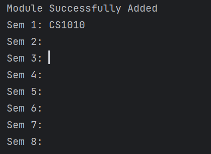

# NUSDegs User Guide

## Introduction

NUSDegs streamlines computing degree planning by offering personalized module schedules, tracking progress, 
and ensuring on-time graduation. It eliminates guesswork, reduces stress, and saves time for students. 
It's a comprehensive tool for efficient and successful degree completion.

## Quick Start

{Give steps to get started quickly}

1. Ensure that you have Java 11 or above installed.
1. Down the latest version of `Duke` from [here](http://link.to/duke).

## Features
- Left
- Required
- Complete
- Info
- Search
- Major
- Add
- Delete

{Give detailed description of each feature}

### Checking modules left: `left`
Displays the modules left, which are the modules required for the user's major that have not been completed.

Format: `left`

Example of usage 1: (scenario where user's selected major is CEG)

User input: 
`left`

- Expected outcome:

### Getting a list of required modules: `required`
Get an overview of required modules for the user's major

Format: `required`

Example of usage 1: (scenario where user's selected major is CEG)

User input:
`required`

- Expected outcome:

### Complete a module: `complete`
Completes a module (not displayed when the feature `left` is used).

Format: `complete`

Example of usage 1: (scenario where user's selected major is CEG)

User input:
`complete ma1511`

Expected outcome:
`Mod completed: MA1511`

Changes to modules left are shown when

User input:
`left`

Expected outcome:

### Get information about a module: `info`
Get information about a module using the info command, followed by one of the commands 'description', 'workload' 
and 'all'.

Format: `info n/command n/moduleCode`

* The `command` cannot be empty.
* The `moduleCode` cannot be empty.

Example of usage: 

`info description CS2113`

- Expected outcome: This course introduces the necessary skills for systematic and rigorous development of software systems. It covers requirements, design, implementation, quality assurance, and project management aspects of small-to-medium size multi-person software projects. The course uses the Object Oriented Programming paradigm. Students of this course will receive hands-on practice of tools commonly used in the industry, such as test automation tools, build automation tools, and code revisioning tools will be covered.

`info workload CS2113`

- Expected outcome: "[2,1,0,3,4]"

`info all`

- Expected outcome: Displays module title and module code of all available modules

### Searching for a module by title: `search`
Search for module title using a keyword.

Format: `search n/KEYWORD`

* The `KEYWORD` cannot be empty.

Example of usage:

`search n/Darwinian`

- Expected outcome:
These are the modules that contain your keyword in the title:

### Selecting your current major: `major`
Saves the selected major into the programme if a major is specified.
Returns the current saved major if no major is specified.

Format: `major n/MAJOR`

* The `MAJOR` is an optional argument to update current major and can be CEG (upcoming feature includes CS).

Examples of usage:

`major CEG`

- Expected outcome: "Major CEG selected!"

`major` (Assume CEG has been selected by the previous command)

- Expected outcome: "Current major is CEG."

### View recommended schedule based on course: recommend
Based on the course, we will provide an recommended schedules that is sorted based on prerequisites.
Format: `recommend MAJOR_CODE`
The input is not case sensitive. E.g CEG or ceg is shown (Currently only works for CEG)

Examples:

Recommend ceg
[CS1010, MA1511, MA1508E, … ,.... ,.... ,... EE4027] (modules required for the degree will be shown)

### View module prerequisites: prereq 
Based on the module selected, we will show what prerequisites the course has in a form of an array. Since NUS has the concept of preclusions, when prerequisites are shown, it is shown based on the degree of the current user, which is currently only computer science and computer engineering students.

Format: `prepreq MODULE_CODE`
The input is not case sensitive. E.g eg1311 or EG1311 is shown
out
Examples:
`Command: prepreq eg1311` (assuming the user is from computer engineering)
[CS1010, MA1511, MA1508E]

Command: pace
You currently have 100MCs left until graduation

### Add module to schedule: `add`
Opens the user's personalized module schedule and adds the chosen module to the semester specified by the user.

Format: `add n/MODULE n/SEMESTER`

* The `MODULE` cannot be empty and must be valid.
* The `SEMESTER` cannot be empty and must be an integer between 1-8 inclusive.

Examples of usage:

`add CS1010 1`

- Expected outcome:

### Delete module from schedule: `delete`
Opens the user's personalized module schedule and deletes the chosen module.

Format: `delete n/MODULE`

* The `MODULE` cannot be empty and must be valid.

Examples of usage:

`delete CS1010` (Assume schedule is currently in the state from the example in `add`)

- Expected outcome:

## FAQ

**Q**: How do I transfer my data to another computer? 

**A**: Currently, this feature is not included in NUSDegs.

## Command Summary

{Give a 'cheat sheet' of commands here}

* Add todo `todo n/TODO_NAME d/DEADLINE`

